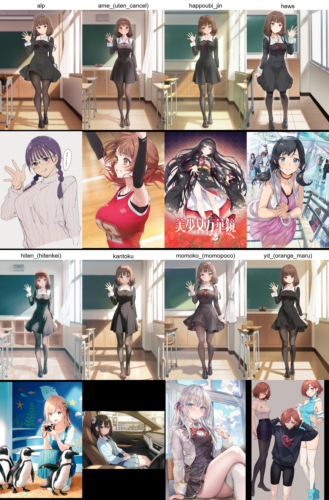

# ComfyScriptDemo
Personal [ComfyScript](https://github.com/Chaoses-Ib/ComfyScript) demo


## 1. Installation
### 1.1. Clone This Repo

1. First install [ComfyUI](https://github.com/comfyanonymous/ComfyUI).
2. Clone this repository into the ComfyUI directory as `ComfyUI/ComfyScriptDemo`.

```bash
cd ComfyUI
git clone https://github.com/DDDDEEP/ComfyScriptDemo.git
```


### 1.2. Install & Use Pipenv

```bash
cd ComfyScriptDemo
python -m pipenv install
python -m pipenv shell
```


### 1.3. Install ComfyScript

Reference from [ComfyScript](https://github.com/Chaoses-Ib/ComfyScript), **and run the following commands in pipenv**:

```bash
cd ../custom_nodes
git clone https://github.com/Chaoses-Ib/ComfyScript.git
cd ComfyScript
python -m pip install -e ".[default]"
```

### 1.4. Duplicate settings.py file

Duplicate the `settings.py.default` configuration file as `settings.py`

All set! The workflow is now configured and ready to run. 🚀


## 2. Workflow Usage

### 2.1. txt2img_artist_gallery

#### 2.1.1 Introduction
- Input a directory path containing original images named after corresponding artists

- Then the workflow will generate an XY comparison matrix between the original images and generated outputs.

- Example output:  


#### 2.1.2 Usage

1. Create configuration file:  
   Duplicate the `txt2img_artist_gallery/settings.py.default` file as `txt2img_artist_gallery/settings.py`

2. Configure `txt2img_artist_gallery/settings.py`:  
   Set required parameters in the configuration file, particularly:
   - `ARTIST_DIRPATH`: Path to your source images directory.  
     Example directory structure:
     
     (Or you can download test artist images from [here](https://drive.google.com/file/d/1JT9zBapx24HLdtsGhU2tuucgwRBPB0gp/view?usp=drive_link))
     ```bash
     - C:\\Softlink\\Gallery\\artist\\normal
        - alp.jpg
        - hews.jpg
        - momoko_(momopoco).jpg
        - ...
     ```


3. Execute the workflow:  
   Run the following commands:
   ```bash
   cd ComfyScriptDemo
   python -m txt2img_artist_gallery.workflow
   ```